<h1 align="center">Drupal 11 CD/CI with DDEV template on Platform.sh Template</h1>

<h2 align="center">Secure your work and see the results of your efforts!</h2>

<p align="center">
<a href="https://www.drupal.org/">

</a>
</p>

<h5 align="left">CREDIT and Enhancement:  The foundations for this template are cloned from the Platform.sh set of templates.  However, it is NOT forked from that template and is heavily modified.  The advantages of the modifications are done in a manner that leverages the core strengths of Platform.sh for multiple, linked environments and Git:GitRepository Version Control.  Core to the advantages of this template are the interlinking of a local machine development environment under Git version control tied directly to a GitRepository and that repository taking advantage of Platform.sh capability to integrate with the hosted environments.  This template then utilizes Drupal's Config_Split and Environment_Indicator modules for a workflow between the local environment and three hosted environments on Platform.sh; develop, staged, and main.  With the repository integration to Platform.sh, the three GitRepository branches drive the three hosted environments.  Thus, every time you update any of those repository branches, Platform.sh rebuilds its hosted environment counter-part.  You, friends, or clients can see the actual operating environment in a browser at any point for each environment.  The version control aspects of this set up helps assure your efforts are secured while the browser visibility of your progress provides excellent prospective on how your efforts are playing out in the real world. </h5>

<!--
<br>
<h1 align="center">Deploy Drupal 11 on Platform.sh</h1>
<br>


<p align="center">
</a>&nbsp&nbsp
<a href="https://github.com/platformsh-templates/drupal11/blob/master/LICENSE">

</a>&nbsp&nbsp
<br /><br />
<a href="https://console.platform.sh/projects/create-project/?template=https://raw.githubusercontent.com/platformsh/template-builder/master/templates/drupal11/.platform.template.yaml&utm_campaign=deploy_on_platform?utm_medium=button&utm_source=affiliate_links&utm_content=https://raw.githubusercontent.com/platformsh-templates/drupal11/updates/.platform.template.yaml" target="_blank" title="Deploy with Platform.sh"></a>
</p>
-->

<hr>

<p align="center">
<strong>Contents</strong>
<br /><br />
<a href="#about"><strong>About</strong></a>&nbsp&nbsp&nbsp&nbsp&nbsp&nbsp
<a href="#features"><strong>Quick Deploy</strong></a>&nbsp&nbsp&nbsp&nbsp&nbsp&nbsp
<a href="#preferred-deployment-option"><strong>Preferred Deployment Option</strong></a>&nbsp&nbsp&nbsp&nbsp&nbsp&nbsp
<a href="#migrate"><strong>Migrate</strong></a>&nbsp&nbsp&nbsp&nbsp&nbsp&nbsp
<a href="#learn"><strong>Learn</strong></a>&nbsp&nbsp&nbsp&nbsp&nbsp&nbsp
<br />
</p>
<hr>

## About

This template uses Drupal the "Drupal Recommended" Composer approach and is set up to use the MariaDB database and Redis for caching.  Because it is intended to be a starting point template to build new Drupal projects, the repository code does NOT contain the database nor the YML configuration files; these being generated after installing the project and doing configuration export when appropriate. Expect that when you start the project in an environment it will ask you to input a project name that will appear on your site header and to provide the email address of you as the administrator.  However, it will skip asking for database credentials because these will be automatically provided.  (The <a href="#setup-script-(recommended-only-for-experienced-users:-click-to-open)"><strong>Setup Script</strong></a> also fills in the user/password/site name.)

Drupal is an extraordinarily capable Content Management System (CMS) appropriate to many internet or intranet uses. It is a very flexible and extensible Open-source framework with tens of thousand of modules contributed through the efforts of its global user community.  Find these and more at [Drupal.org]( http://Drupal.org)

If you are new to Drupal you probably have never heard of Drush.  You will probably start out using the Graphical User Interface (GUI) system right in the website.  But Drush can become a short-cut to you to accomplish some common things from the Command Line or Terminal of you computer.

### Features

- PHP 8.3
- MariaDB 10.11
- Redis 7.2
- Drush included
- Composer-based build
- Ablity to Associate your custom URL on the host


<details>
<summary><h3>Quick Deploy Option(Click to open)</h3></summary>

<p align="center"><h6>NOTE: You probably don't want to use Quick Deploy if you don't already have experience using this repository in setting up a prior project on Platform.sh and if you don't need to use the local environment to work offline or with co-developers.!</h6></p>

The quickest way to deploy this template on Platform.sh is by clicking the button below.
This will automatically create a new project and initialize the repository for you.

<p align="center">
    <a href="https://console.platform.sh/projects/create-project/?template=https://raw.githubusercontent.com/platformsh/template-builder/master/templates/drupal11/.platform.template.yaml">
        
    </a>
</p>
<br/>
</details>
<br>

<hr>

# Preferred Deployment Option


<details>
<summary><h3>Prerequisites (Click to open)</h3></summary>


To set up and deploy this project, ensure you have the following tools and accounts. These are essential for local development, version control, and Platform.sh hosting.

#### System Requirements
- **Operating System**: macOS, Linux, or Windows 10/11.
- **RAM**: At least 8GB (16GB recommended for Docker/DDEV).
- **Disk Space**: 5GB free for Docker images, Drupal files, and database.
- **PHP**: Version 8.3 (handled by DDEV).  
  **[Beginner Tip]**: PHP is the programming language Drupal uses. DDEV sets it up for you, so you don’t need to install it manually.
- **Node.js** (optional): For running Gulp tasks or front-end tools. Install via [nodejs.org](https://nodejs.org/).  
  **[Beginner Tip]**: Node.js is only needed if you work on custom themes with tools like Gulp. You can skip this for now.

#### Account Requirements
- **GitHub Account**: For version control and CI/CD. Sign up at [github.com](https://github.com/). Ensure your SSH key is added to GitHub ([instructions](https://docs.github.com/en/authentication/connecting-to-github-with-ssh)).  
  **[Beginner Tip]**: GitHub is like a cloud storage for your code, where you save and share your project. SSH keys are like a password to securely connect your computer to GitHub.
- **Platform.sh Account**: For cloud hosting. Sign up for a trial at [platform.sh](https://platform.sh/trial/).  
  **[Beginner Tip]**: Platform.sh is a service that hosts your Drupal site online, like renting a server to make your site accessible to the world.

#### Software Requirements
- **Docker Desktop**: Runs DDEV for local development. Download from [docker.com](https://www.docker.com/products/docker-desktop/).  
  **[Beginner Tip]**: Docker is a tool that creates isolated environments (containers) to run your site locally, mimicking a web server without manual setup. Install Docker Desktop, ensure it’s running, and allocate at least 4GB RAM in its settings.
- **DDEV**: A Docker-based tool for Drupal development. Install via `brew install ddev` (macOS/Linux) or follow [DDEV installation instructions](https://ddev.readthedocs.io/en/stable/#installation) for Windows.  
  **[Beginner Tip]**: DDEV simplifies setting up a local Drupal site with PHP, MySQL, and a web server. It’s like a pre-packaged kitchen for cooking your Drupal site locally.
- **Composer**: PHP dependency manager for Drupal. Install via [getcomposer.org](https://getcomposer.org/download/).  
  **[Beginner Tip]**: Composer is like a shopping list that automatically downloads Drupal’s core files and modules. Run `composer --version` to check if it’s installed.
- **Git**: Version control system. Install via `brew install git` (macOS), `apt-get install git` (Linux), or [git-scm.com](https://git-scm.com/downloads) for Windows.  
  **[Beginner Tip]**: Git tracks changes to your code, like a time machine for your project. You’ll use it to save and share your work.
- **Platform.sh CLI**: Command-line tool for managing Platform.sh projects. Install via `curl -fsS https://platform.sh/cli/installer | php`.  
  **[Beginner Tip]**: The Platform.sh CLI lets you control your cloud-hosted site from your terminal, like a remote control for your website.
- **Visual Studio Code (VSCode)**: Recommended Integrated Development Environment (IDE) for editing code and managing Git. Download from [code.visualstudio.com](https://code.visualstudio.com/).  
  **[Why Use VSCode?]**: VSCode is beginner-friendly, free, and supports Drupal development with syntax highlighting, debugging, and Git integration. It’s like a smart notebook that helps you write, organize, and track code changes. Install these VSCode extensions for Git/GitHub support:
    - **GitLens** (`eamodio.gitlens`): Enhances Git features, showing commit history and changes inline.
    - **GitHub Pull Requests and Issues** (`github.vscode-pull-request-github`): Manages GitHub repositories directly in VSCode.
    - **Drupal** (`marabesi.drupal`): Adds Drupal-specific syntax and snippets.
    - **PHP Intelephense** (`bmewburn.vscode-intelephense-client`): Improves PHP code completion and debugging.
  **[Beginner Tip]**: Install extensions in VSCode by clicking the Extensions icon (square with an arrow) in the sidebar, searching for the extension name, and clicking “Install.” Watch these videos for VSCode and Git basics:
    - [VSCode Git Basics](https://www.youtube.com/watch?v=i_23KUAetlM) (5 min)
    - [Using GitHub with VSCode](https://www.youtube.com/watch?v=D6yUK3W2bH0) (10 min)


### Check for prerequisites
```bash
command -v git >/dev/null 2>&1 || { echo "Git is required. Install it from https://git-scm.com/downloads"; exit 1; }
command -v ddev >/dev/null 2>&1 || { echo "DDEV is required. Install it from https://ddev.readthedocs.io/en/stable/#installation"; exit 1; }
command -v composer >/dev/null 2>&1 || { echo "Composer is required. Install it from https://getcomposer.org/download/"; exit 1; }
command -v docker >/dev/null 2>&1 || { echo "Docker is required. Install it from https://www.docker.com/products/docker-desktop/"; exit 1; }
```
</details>

## Local Development Setup

This section guides you through setting up the project locally using DDEV. Experienced users can run the provided setup script or follow the manual steps. Beginners should read the detailed explanations for clarity.

<details>
<summary><h2>Setup Script (Recommended only for Experienced Users: Click to open)</h2></summary>

For convenience, a setup script (`setup-local.sh`) automates cloning the repository, configuring DDEV, installing dependencies, and setting up Drupal. Save the script, make it executable (`chmod +x setup-local.sh`), and run it (`./setup-local.sh`).

```bash
#!/bin/bash
# Setup script for Drupal 11 CD/CI with DDEV and Platform.sh
# Run this in a new directory to set up the project locally

# Exit on error
set -e

echo "Starting local setup for Drupal 11 project..."


# Clone the repository
echo "Cloning the repository..."
git clone git@github.com:RightsandWrongsgit/Drupal-11-CD-CI-with-DDEV.git
cd Drupal-10-CD-CI-with-DDEV

# Configure DDEV
echo "Configuring DDEV..."
ddev config --project-type drupal11 --docroot web --php-version 8.3
ddev start

# Install dependencies
echo "Installing Composer dependencies..."
ddev composer install

# Install Drupal
# You can edit the site name on the line below before you run this script if you want
echo "Installing Drupal with Drush..."
ddev drush site:install standard --account-name=admin --account-pass=admin --site-name="My Drupal Site" -y

# Enable config_split and environment_indicator
echo "Enabling config_split and environment_indicator modules..."
ddev drush pm:enable config_split environment_indicator -y

# Generate a one-time login link
echo "Generating login link..."
ddev drush uli

echo "Setup complete! Access your site via 'ddev launch' or the URL above."
echo
echo "Log in to your running site with User=admin and Password=admin"
echo "You Site Name was set to 'My Drupal Site'.  Under 'Administration' you can change it in 'Site Settings'."
echo
echo "You can work on your site through the menu system.  But is you need to run 'composer', 'drush' or code "
echo "use VSCode to open the project folder (finder on a Mac) for editing and for Git management."
```
</details>

******************************************************************************************************************

## Setup Steps

**For Experienced Users**:

1. Open your IDE; documentation uses VSCode examples
2. Clone the repo: `git clone git@github.com:RightsandWrongsgit/Drupal-11-CD-CI-with-DDEV.git && cd Drupal-11-CD-CI-with-DDEV`
3. Configure DDEV: `ddev config --project-type drupal11 --docroot web --php-version 8.3`
4. Start DDEV: `ddev start`
5. Install dependencies: `ddev composer install`
6. Install Drupal: `ddev drush site:install standard --account-name=admin --account-pass=admin -y`
7. Enable modules: `ddev drush pm:enable config_split environment_indicator -y`
8. Launch site: `ddev launch`

<br>
<br>
<br>
NOTE: The Beginners set up steps are the same as above but are annotated with what is going on as you to each step.
<br>
</br>

**For Beginners**:
- **[Step 1: Clone the Repository]** Clone the project using Git. Open your terminal (or VSCode’s integrated terminal: `Ctrl+``), navigate to a directory (e.g., `~/Sites`), and run:


  ```bash
  git clone git@github.com:RightsandWrongsgit/Drupal-11-CD-CI-with-DDEV.git
  cd Drupal-11-CD-CI-with-DDEV
  ```


  This downloads the project to your computer. If you get an SSH error, ensure your GitHub SSH key is set up ([guide](https://docs.github.com/en/authentication/connecting-to-github-with-ssh)).
- **[Step 2: Set Up DDEV]** Run `ddev config --project-type drupal11 --docroot web --php-version 8.3` to configure DDEV for Drupal 10. Then, start DDEV with `ddev start`. This creates a local server with PHP 8.3 and MariaDB, like a mini web host on your computer.
- **[Step 3: Install Dependencies]** Run `ddev composer install` to download Drupal core and modules, like ordering ingredients for a recipe.
- **[Step 4: Install Drupal]** Run `ddev drush site:install standard --account-name=admin --account-pass=admin -y` to set up Drupal with an admin account (username: admin, password: admin). Drush is a command-line tool that simplifies Drupal tasks.
- **[Step 5: Enable Modules]** Run `ddev drush pm:enable config_split environment_indicator -y` to enable environment-specific settings and visual indicators. These modules help manage different settings for local, staging, and production environments and show which environment you’re in (e.g., a colored bar in the admin interface).
- **[Step 6: Access the Site]** Run `ddev launch` to open the site in your browser, or use `ddev drush uli` to get a one-time login link for the admin account.

**VSCode Tip**: Open the project folder in VSCode (`code .` in the terminal). Use GitLens to view changes, commit with `Ctrl+Enter`, and push to GitHub via the Source Control panel. See the [Working with GitHub in VSCode](https://code.visualstudio.com/docs/sourcecontrol/github) for details.
<br>
<br>

## Platform.sh Deployment

Deploying to Platform.sh hosts your site in the cloud with automated scaling and services. The project includes a `.platform.app.yaml` file for Platform.sh configuration and a `settings.platformsh.php` file for environment-specific settings.

**For Experienced Users**:
1. Create a Platform.sh project: `platform project:create --title "My Drupal Site" --region <region>`.
2. Add Git remote: `platform project:set-remote <project-id>`.
3. Push code: `git push platform main`.
4. Upload files (if migrating): `platform mount:upload --mount web/sites/default/files --source ./files`.
5. Run Drupal installer via browser (`platform url`) or Drush: `ddev drush site:install`.
6. Enable `config_split` settings: `platform variable:set -e main drupalsettings:config_split.config_split.local.enabled true` (for local-specific settings).

**For Beginners**:
- **[Step 1: Set Up Platform.sh]** Sign up for a Platform.sh trial ([platform.sh](https://platform.sh/trial/)). Install the Platform.sh CLI (`curl -fsS https://platform.sh/cli/installer | php`). Create a new project with `platform project:create --title "My Drupal Site" --region us-2.platform.sh`. This sets up a cloud server for your site.
- **[Step 2: Link to GitHub]** Run `platform project:set-remote <project-id>` (replace `<project-id>` with the ID from the previous step). This connects your local Git repository to Platform.sh, like linking your phone to a cloud service.
- **[Step 3: Push Code]** Run `git push platform main` to upload your code. Platform.sh builds and deploys your site, using the `.platform.app.yaml` file to configure PHP, MariaDB, and Redis.
- **[Step 4: Upload Files]** If migrating an existing site, upload public files with `platform mount:upload --mount web/sites/default/files --source ./files`. This moves files (e.g., images) to Platform.sh, like copying photos to cloud storage.
- **[Step 5: Install Drupal]** Visit the site URL (`platform url`) to run Drupal’s installer in your browser. The `settings.platformsh.php` file automatically provides database credentials, so you won’t need to enter them. Alternatively, use `ddev drush site:install` if you prefer the command line.
- **[Step 6: Configure Environments]** The `settings.platformsh.php` file uses `config_split` to apply settings based on the environment (local, staging, production). For example, it enables verbose logging locally but disables it in production. The `environment_indicator` module adds a colored bar (e.g., green for local, red for production) to the admin interface, so you always know which environment you’re in. Set environment-specific variables with `platform variable:set -e main drupalsettings:config_split.config_split.local.enabled true` to enable local settings.

**Environment-Specific Settings**:
- The `settings.platformsh.php` file (located in `web/sites/default`) integrates with Platform.sh’s environment variables to configure database connections, Redis caching, and `config_split` settings. It checks the environment (e.g., `PLATFORM_BRANCH`) to apply settings like:
  - Local: Enables `config_split.config_split.local` for development modules (e.g., Devel) and verbose logging.
  - Staging/Production: Enables `config_split.config_split.production` for optimized settings and disables debugging.
- The `environment_indicator` module visually distinguishes environments in the Drupal admin interface, reducing errors when working across local, staging, or production sites. Configure it via `/admin/config/development/environment_indicator` or Drush: `ddev drush cset environment_indicator.indicator name "Local" -y`.

**VSCode Tip**: Use the Platform.sh CLI in VSCode’s terminal to manage deployments. The GitHub Pull Requests extension lets you monitor CI/CD workflows directly in VSCode.


## Local development

This section provides instructions for running the `drupal11` template locally, connected to a live database instance on an active Platform.sh environment.

In all cases for developing with Platform.sh, it's important to develop on an isolated environment - do not connect to data on your production environment when developing locally.
Each of the options below assume that you have already deployed this template to Platform.sh, as well as the following starting commands:

```bash
$ platform get PROJECT_ID
$ cd project-name
$ platform environment:branch updates
```

<details>
<summary>Drupal: using ddev</summary><br />

ddev provides an integration with Platform.sh that makes it simple to develop Drupal locally. Check the [providers documentation](https://ddev.readthedocs.io/en/latest/users/providers/platform/) for the most up-to-date information.

In general, the steps are as follows:

1. [Install ddev](https://ddev.readthedocs.io/en/stable/#installation).
1. Run `ddev config`.
1. [Retrieve an API token](https://docs.platform.sh/development/cli/api-tokens.html#get-a-token) for your organization via the management console.
1. Update your dedev global configuration file to use the token you've just retrieved:
    ```yaml
    web_environment:
    - PLATFORMSH_CLI_TOKEN=abcdeyourtoken`
    ```
1. Run `ddev restart`.
1. Get your project ID with `platform project:info`. If you have not already connected your local repo with the project (as is the case with a source integration, by default), you can run `platform project:list` to locate the project ID, and `platform project:set-remote PROJECT_ID` to configure Platform.sh locally.
1. Update the `.ddev/providers/platform.yaml` file for your current setup:
    ```yaml
    environment_variables:
    project_id: PROJECT_ID
    environment: CURRENT_ENVIRONMENT
    application: drupal
    ```
1. Get the current environment's data with `ddev pull platform`.
1. When you have finished with your work, run `ddev stop` and `ddev poweroff`.

</details>
<details>
<summary>Drupal: using Lando</summary><br />

Lando supports PHP applications [configured to run on Platform.sh](https://docs.platform.sh/development/local/lando.html), and pulls from the same container registry Platform.sh uses on your remote environments during your local builds through its own [recipe and plugin](https://docs.lando.dev/platformsh/).

1. [Install Lando](https://docs.lando.dev/getting-started/installation.html).
1. Make sure Docker is already running - Lando will attempt to start Docker for you, but it's best to have it running in the background before beginning.
1. Start your apps and services with the command `lando start`.
1. To get up-to-date data from your Platform.sh environment ([services *and* mounts](https://docs.lando.dev/platformsh/sync.html#pulling)), run the command `lando pull`.
1. If at any time you have updated your Platform.sh configuration files, run the command `lando rebuild`.
1. When you have finished with your work, run `lando stop` and `lando poweroff`.

</details>


> **Note:**
>
> For many of the steps above, you may need to include the CLI flags `-p PROJECT_ID` and `-e ENVIRONMENT_ID` if you are not in the project directory or if the environment is associated with an existing pull request.


#### Other deployment options

For all of the other options below, clone this repository first:

```bash
git clone https://github.com/platformsh-templates/drupal11
```

If you're trying to deploy from GitHub, you can generate a copy of this repository first in your own namespace by clicking the [Use this template](https://github.com/platformsh-templates/drupal11/generate) button at the top of this page.

Then you can clone a copy of it locally with `git clone git@github.com:YOUR_NAMESPACE/drupal11.git`.


<details>
<summary>Deploy directly to Platform.sh from the command line</summary>
<!-- <blockquote>
<br/> -->

1. Create a free trial:

   [Register for a 30 day free trial with Platform.sh](https://auth.api.platform.sh/register). When you have completed signup, select the **Create from scratch** project option. Give you project a name, and select a region where you would like it to be deployed. As for the *Production environment* option, make sure to match it to this repository's settings, or to what you have updated the default branch to locally.

1. Install the Platform.sh CLI

   #### Linux/OSX

   ```bash
   curl -sS https://platform.sh/cli/installer | php
   ```

   #### Windows

   ```bash
   curl -f https://platform.sh/cli/installer -o cli-installer.php
   php cli-installer.php
   ```

   You can verify the installation by logging in (`platformsh login`) and listing your projects (`platform project:list`).

1. Set the project remote

   Find your `PROJECT_ID` by running the command `platform project:list`

   ```bash
   +---------------+------------------------------------+------------------+---------------------------------+
   | ID            | Title                              | Region           | Organization                    |
   +---------------+------------------------------------+------------------+---------------------------------+
   | PROJECT_ID    | Your Project Name                  | xx-5.platform.sh | your-username                   |
   +---------------+------------------------------------+------------------+---------------------------------+
   ```

   Then from within your local copy, run the command `platform project:set-remote PROJECT_ID`.

1. Push

   ```bash
   git push platform DEFAULT_BRANCH
   ```

<!-- <br/>
</blockquote> -->
</details>

<details>
<summary>Integrate with a GitHub repo and deploy pull requests</summary>
<!-- <blockquote>
<br/> -->

1. Create a free trial:

   [Register for a 30 day free trial with Platform.sh](https://auth.api.platform.sh/register). When you have completed signup, select the **Create from scratch** project option. Give you project a name, and select a region where you would like it to be deployed. As for the *Production environment* option, make sure to match it to whatever you have set at `https://YOUR_NAMESPACE/nextjs-drupal`.

1. Install the Platform.sh CLI

   #### Linux/OSX

   ```bash
   curl -sS https://platform.sh/cli/installer | php
   ```

   #### Windows

   ```bash
   curl -f https://platform.sh/cli/installer -o cli-installer.php
   php cli-installer.php
   ```

   You can verify the installation by logging in (`platformsh login`) and listing your projects (`platform project:list`).

1. Setup the integration:

   Consult the [GitHub integration documentation](https://docs.platform.sh/integrations/source/github.html#setup) to finish connecting your repository to a project on Platform.sh. You will need to create an Access token on GitHub to do so.

<!-- <br/>
</blockquote> -->
</details>

<!--
<details>
<summary>Integrate with a GitLab repo and deploy merge requests</summary>
<!-- <blockquote>
<br/> -->
<!--
1. Create a free trial:

   [Register for a 30 day free trial with Platform.sh](https://auth.api.platform.sh/register). When you have completed signup, select the **Create from scratch** project option. Give you project a name, and select a region where you would like it to be deployed. As for the *Production environment* option, make sure to match it to this repository's settings, or to what you have updated the default branch to locally.

1. Install the Platform.sh CLI

   #### Linux/OSX

   ```bash
   curl -sS https://platform.sh/cli/installer | php
   ```

   #### Windows

   ```bash
   curl -f https://platform.sh/cli/installer -o cli-installer.php
   php cli-installer.php
   ```

   You can verify the installation by logging in (`platformsh login`) and listing your projects (`platform project:list`).

1. Create the repository

   Create a new repository on GitLab, set it as a new remote for your local copy, and push to the default branch.

1. Setup the integration:

   Consult the [GitLab integration documentation](https://docs.platform.sh/integrations/source/gitlab.html#setup) to finish connecting a repository to a project on Platform.sh. You will need to create an Access token on GitLab to do so.

<!-- <br/>
</blockquote> -->
<!--
</details>

<details>
<summary>Integrate with a Bitbucket repo and deploy pull requests</summary>
<!-- <blockquote>
<br/> -->
<!--
1. Create a free trial:

   [Register for a 30 day free trial with Platform.sh](https://auth.api.platform.sh/register). When you have completed signup, select the **Create from scratch** project option. Give you project a name, and select a region where you would like it to be deployed. As for the *Production environment* option, make sure to match it to this repository's settings, or to what you have updated the default branch to locally.

1. Install the Platform.sh CLI

   #### Linux/OSX

   ```bash
   curl -sS https://platform.sh/cli/installer | php
   ```

   #### Windows

   ```bash
   curl -f https://platform.sh/cli/installer -o cli-installer.php
   php cli-installer.php
   ```

   You can verify the installation by logging in (`platformsh login`) and listing your projects (`platform project:list`).

1. Create the repository

   Create a new repository on Bitbucket, set it as a new remote for your local copy, and push to the default branch.

1. Setup the integration:

   Consult the [Bitbucket integration documentation](https://docs.platform.sh/integrations/source/bitbucket.html#setup) to finish connecting a repository to a project on Platform.sh. You will need to create an Access token on Bitbucket to do so.

<!-- <br/>
</blockquote> -->
</details>
<!--
-->

## Post-install

Run through the Drupal installer as normal.  You will not be asked for database credentials as those are already provided.

<details>
<summary><h3>Project Browser & Recipes(Optional! Click to open)</h3></summary>

</details>

<details>
<summary><h3>Structure Sync(Optional! Click to open)</h3></summary>

### Basic Different Between Code and Content

Understanding some of this begins to get you to wrap your head around “code” versus “content”. Let’s consider an example. Your code might define the fields in a basic page; lets say the fields define a name and address and phone numbers. Your content would be a list of actual people and their address and phones that would be stored in the database. We might have half a dozen fields set up in the code for various things about them. In contrast we could have tens of thousands of their individual names, addresses, phone numbers and other stuff in the database.

### Drupal’s Slight Idiosyncratic Code vs Content Consideration

There are a handful of items where the “what is code” vs “what is content” question isn’t as crystal clear. Menus/taxonomy/blocks are where the line blurs. Take taxonomy… you might have a restaurant taxonomy for the ‘style’ of dining and another for the ‘cuisine’. Well, the style and the cuisine are taxonomies defined by code but the term items within each is content; e.g. restaurant ‘style’ is code but casual, food truck, fine dinning, fast food, etc. are stored as content. ‘Cuisine’ is code but pizza, Chinese, Indian, south pacific, French, etc. are stored as content. Same sort of deal on menus where you might have a menu in main navigation right below the hero section and another menu in the footer; these being code but the individual items you can select from in each menu is stored as content.

This code or content stuff is of more than academic interest. You know that you can share code between environments just like you already did with a ‘local’ and a ‘main’ copy of your files moving with Git/GitHub. Since you know how to do a simple export and import of configuration via YML files, you have those things in code also well covered. You might think that your core foundational website would be fine as you developed, and moved the updated code to ‘main’ for production were your database of content would be linked into it. However, wrap your head around a mental image where you are developing around menu option but none of you actual menu option names are showing up; or where you see some classification taxonomy but no actual terms in it for you to relate to. Having some of these core things being ‘content’ rather than ‘code’ can make working uncomfortable.

### Structure_Sync Module to the Rescue

Sure, if you were working on a really small site and had high speed bandwidth, you could move a copy of your whole database back and forth to have ‘code’ and ‘content’ fully available in all environments. If you have a huge website of content and had to move it all every time you were working on your site you would not be happy. Still, if your menus details, taxonomy items, and blocks are just in the database you would feel sort of in a contextual vacuum as you worked. So there is a module you can install that simply grabs the content from the database for menu/taxonomy/block items and folds them into your configuration workflow (with a couple extra “Drush” commands. What you will want is to install and enable the structure_sync module:

lando composer require drupal/structure_sync
lando drush en structure_sync

### A Brief Explanation: Menu/Taxonomy/Blocks

We said some pretty important items on the edge of the code-content borderline get synchronized in your work flow with this module. These are menu, taxonomy, and blocks. Examples were already provided for menu and taxonomy. Let’s next understand blocks.

Blocks are one type of what Drupal calls ‘entities’. That doesn’t do much for me because Drupal sort of defaults to everything being some sort of entity - people, pages, blocks… I mentally simplify Blocks as being chunks of a page within a page (purest, don’t beat me up). Even UI designers tend to think of page layouts as organized into chunks and they may even plot out a grid system approach to display. Think of Drupal Blocks as doing that but because Drupal is a content management system it can reuse them on different pages. Heck, Drupal can conditionally display blocks differently within different contexts. It can retrieve database stored parts, or blocks, to make a unique whole on the fly! These are powerful capabilities that you will use. You can kind of see how these chunks would be consider content. Yet, if you think of some block that your drop into a sidebar on a variety of page types you can kind of see how having them present in a working development environment can provide a valuable context.

### How to think about using Structure_Sync

To wrap your head around this [Structure_Sync module](https://www.freelock.com/blog/john-locke/2023-04/deploying-blocks-and-content-other-site-environments) it helps to think about where this module places itself in the Drupal Administration. You will find it under the “Structure” main menu rather than under the “Configuration”. Why would that be since it works with configuration at that code-content borderline? The reason is because you are more likely to be using it while you are working with something you are doing with the Structure aspects of your website. And, once you set it, it simply works with the rest of Configuration naturally. I am not saying you won’t update it and then need to do a “drush cex” and “drush cim”. But unless you are adding or changing the menu, taxonomies, or blocks, once you set it up, it should fly on auto-pilot with normal configuration workflow.

It probably makes sense to start by looking at the GUI interface that was added as an option under Structure.

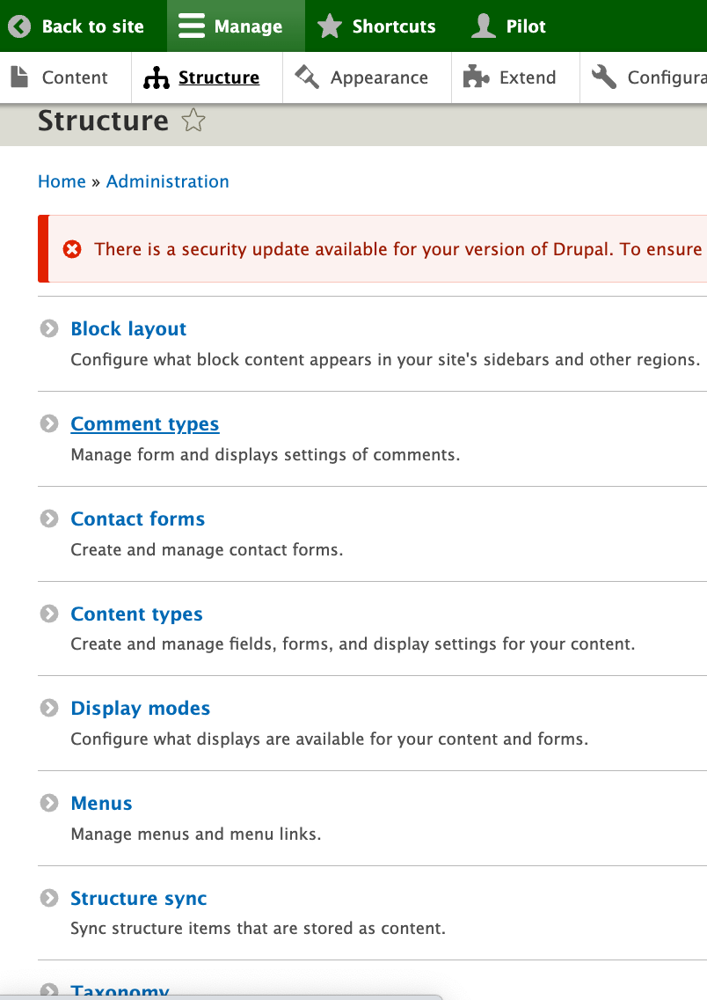

Click on the Structure Sync option and you will find separate tabs for menus, taxonomies, and blocks that work the same way but they present separately so you don’t have to figure out which are available from one large cluster. What is available to export shows up on a list with that title that looks very much like a configuration GUI. Like the example image, you probably are going to checkbox all of them unless you have some reason not to, like a work in progress item..

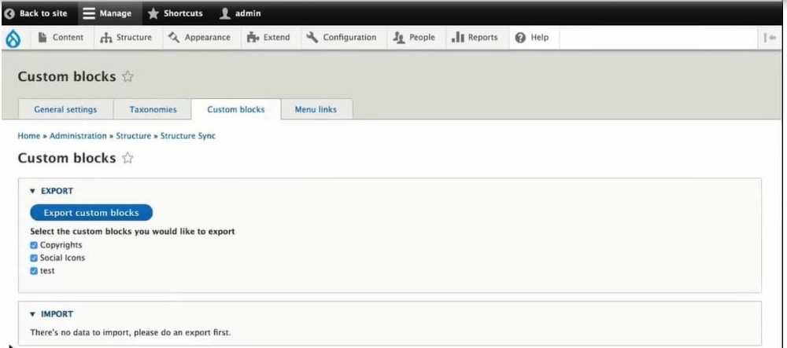


After you select the items for export, you need to click that blue button labeled “Export..Something” and the Something will depend on if it is a block, a menu, or a taxonomy. After you do that for each tab option, then you want to export your configuration; remember we do that with one of these commands depending how how we are running our project:

`drush cex` or `DDEV drush cex` or `lando drush cex`

To go prove to yourself how this works, you can pop over to your configuration and see that a new file has been added. In our case, you can look in that left directory map panel of VSCode and see the /config/sync subdirectory which had all those ‘yml’ files we found after our prior `drush cex` and you will find a new one called `structure_sync.data.yml` in the list.

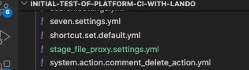

That little blue Git indicator should also show a count of “1” (or more if you did something else too) for the file change/addition of that file. While that `drush cex` runs, it will likely show you an expected update in a box like shown below and ask you to confirm with a ‘yes’ that you want to overwrite the prior export with the more current one.

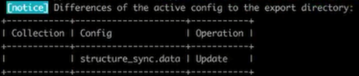

## The STEPS

Like typical, that ‘yml’ file that was exported in your ‘local’ environment is sitting available. But it isn’t doing anything to your upstream alternative environment configurations until they would import it. Think the steps this way:

You build your menu, taxonomy, and/or blocks; in our case in our Lando ‘local’ site.

Then you mark those you wish to make available in other environments with Structure_Sync using either the GUI interface or some CLI alternatives we will discuss shortly.

Doing a configuration export `drush cex` in your local Lando environment puts a new structure_sync.data.yml file into your yml files used to pass to other environments.

In our case, and our little blue dots showing files have changed but not been version controlled, we can ‘commit/stage/sync’ in VSCode. The files will then be in our GitHub and in the Platform.sh environment for the branch we are working on.

If that new yml file is in the environment, a`drush cim` put it into ‘active’ configuration. We want to make sure the ‘setting’ within that yml file align between environments so we tell the ‘active’ configuration to leverage the knowledge imbedded in that file to set matching menu, taxonomy, and blocks in the alternative environment. To do that you go back in the GUI where you can now see the “Import..Something” is populated and you can hit one of the three buttons to do so.

### There are three option buttons to select from; Safely, Full, and Force.

Safely
= ‘new stuff’ and it only imports those custom blocks/taxonomies/menus in config that were not previously there.

Full
= ‘new and refresh’ because it imports all the custom blocks/taxonomies/menus regardless if they have already existed before. It deletes any custom blocks/taxonomies/menus that are not in config which might be a little questionable if somehow your exported list had changed unintentionally; like you forgot to check all the boxes at export because you thought you were just wanting to add the new ones (crash and burn but you can go back local and redo the process to dig out of the hole).

Force
= ‘skate on thin ice’ because this option will not check for any existing blocks, menus or taxonomies and just deletes all custom blocks/taxonomies/menus in the system and creates new ones.

### Here is the GUI way —

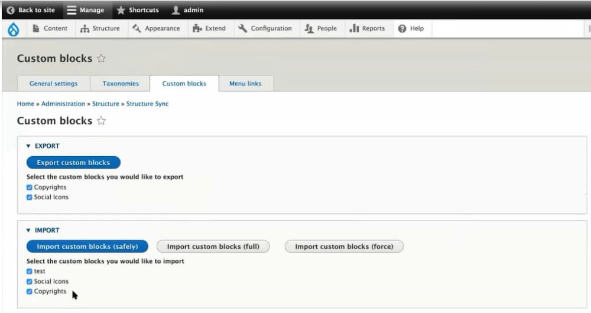

Click for a [good overview of this process](https://www.specbee.com/blogs/export-import-menus-customblocks-taxonomies-drupal9-8-structure-sync-module) by an actually eloquent writer.

### Or do it by CLI

If you are a Command Line Interface (CLI) person, there are drush commands to do what the GUI offers. REMEMBER THAT SINCE WE ARE USING LANDO for our local environment, we need to preceed these with ‘lando drush somecommand’

The drush commands and their abbreviations are:

export-taxonomies (et) - Export taxonomy terms to configuration import-taxonomies (it) - Import taxonomy terms from configuration export-blocks (eb) - Export custom blocks to configuration import-blocks (ib) - Import custom blocks from configuration export-menus (em) - Export menu links to configuration import-menus (im) - Import menu links from configuration export-all (ea) - Export taxonomy terms, custom blocks and menu links to configuration import-all (ia) - Import taxonomy terms, custom blocks and menu links from configuration

In case you were wondering how the Full/Safe/Force import options play out under these with drush CLI, you will get the option list after you type and run the basic command:

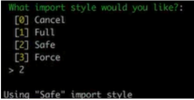

</details>

<details>
<summary><h3>Environment Splits(Required! Click to open)</h3></summary>

The templated project will run without doing the split customizations.  But you really won't get the CD/CI workflow advantages without doing these steps.  And things could become pretty strange if you left you email and analytics blasting in local development; or you left some of the development tools open in a production site exposing a security risk.  So don't complain, just do these steps:

You will notice something different in the directory structure of this repository 'config' compared to a generic Drupal project.  Notice there are subdirectories for 'develop', 'local', 'main', 'staged' and 'sync'.  This is critical to house the configurations for each of the different environments in your CD/CI workflow.  Like the normal 'sync' subdirectory they will be home to YML files which represent the settings of your website that represent what is in your associated database.  At the start of using this template, they are empty other then a .gitkeep file to hold them in the ready.  Once you have cloned the template and brought up your personal version of the Drupal website, a database will automatically be connected with your running project.  At that point you can 'config export' (CEX) the database configuration as YML files and they will populate these subdirectories.

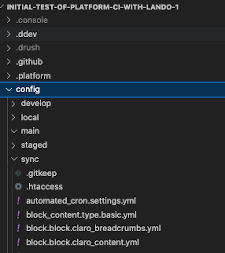


The image below shows an example of a very abbreviated list of the YML files in the standard config/sync directory that are common to configurations across all environments. 

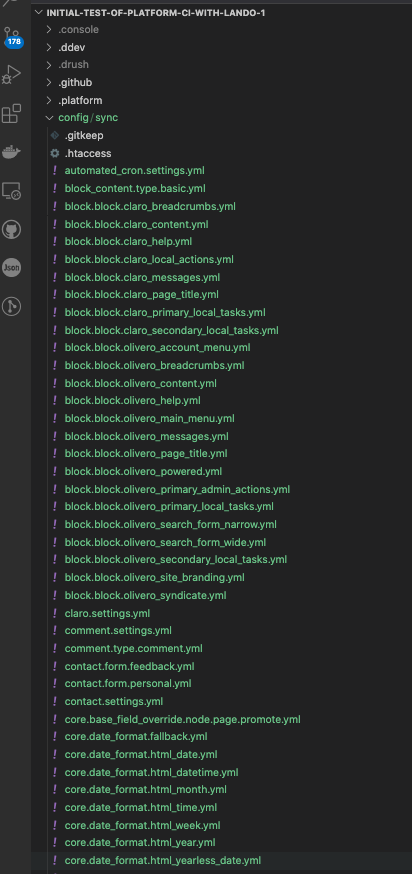

### Configurations by split

Glance at the very top section of the table below. That table shows Drupal Core modules and settings plus the environment_indicator and the structure_sync module as examples of contributed modules present across all environments. 

The table also shows the four split column names that we set up as directory homes for configuration files; uniquely for ‘main’, ‘staged’, ‘develop’ and ‘local’. Under each named split are modules you might consider installing for that unique environment. Remember that the easiest way to think about config_split is that it ADDS TO or OVERRIDES what you have in THE BASE 'sync' configuration.

You can add, enable, disable, modules and site settings any time you want.  From a command line (terminal, your IDE terminal, the Platform CLI) just by doing the classic (composer require 'drupal/insertmodulename') for each of the modules to be added to your system and the classic (drush en 'insertmodulename') IF THEY ARE TO BE USE ACROSS 'ALL' ENVIRONMENTS. Example below:

```bash
composer require drupal/devel
drush en devel -y
```
 
However, if you want to have a module used only in specific environments DO NOT ENABLE these modules like we previously did!  We are going to take a special approach to doing that only within the split where we want them.

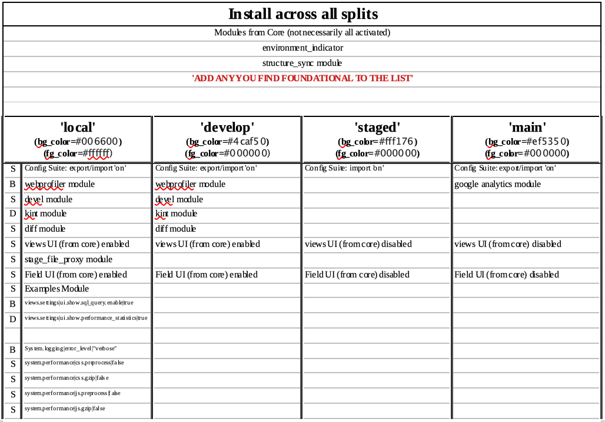

Go into the ‘Configuration’ menu under Administration and find the ‘Development’ section. There select the ‘Configuration Split settings’ option.

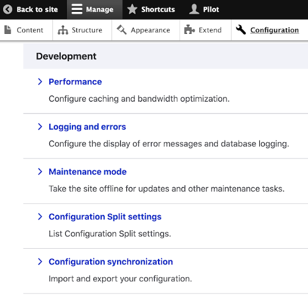

We will ‘Add Configuration Split setting’ for each of the named splits we establish; ‘main’, ‘stage’, ‘develop’, and ‘local’.

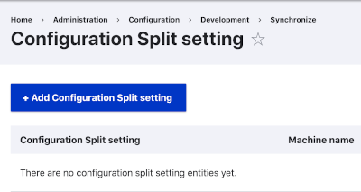

For now, we aren’t going to put all the different module and setting attributes we will eventually want from that table of options by environment presented earlier. We will simply start with the basics of naming those four splits and pointing the module to the location sub-directories we set up. There are fill-in boxes for the name (Label), an optional description, the location (Folder), and a checkbox for ‘Active’ or not. Leave the Weight option at its default zero. Uncheck the ‘Active’ box; remembering we have the syntax in our `settings.php` file to do this dyanmically. In the example below, we are setting up ‘main’ and pointing to the folder location sub-directory we established for that environment `../config/main`

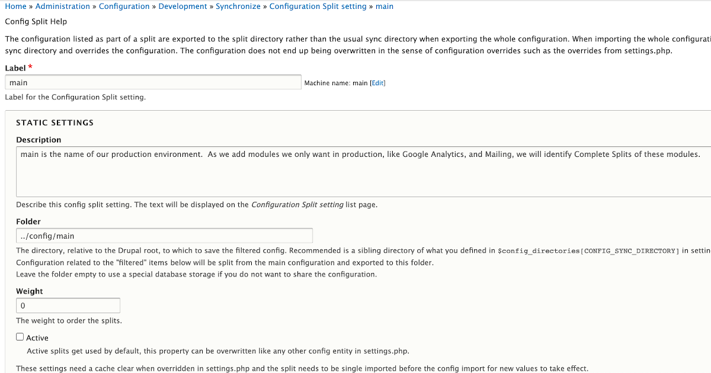

Scroll past the ‘Complete split’ and ‘Conditional split’ sections; each of which offer options at the module or configuration item level from the decision we made in our table of environment preferences. Don’t mess with these for now. However, it is informative to see a list of your module’s checkboxes and configuration items with checkboxes. A glance at the names of the configuration items looking a lot like the file names your ‘drush cex’ exported as yml files but without that final file name extension showing.

Just scroll on past the two checkboxes but this time leave them checked. Then hit the “Save” button

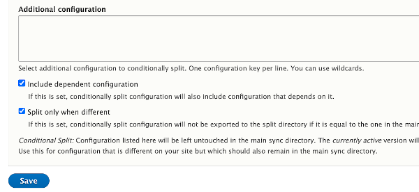

When you have all four environments named and pointing to their sub-directory homes, you should see something like this:

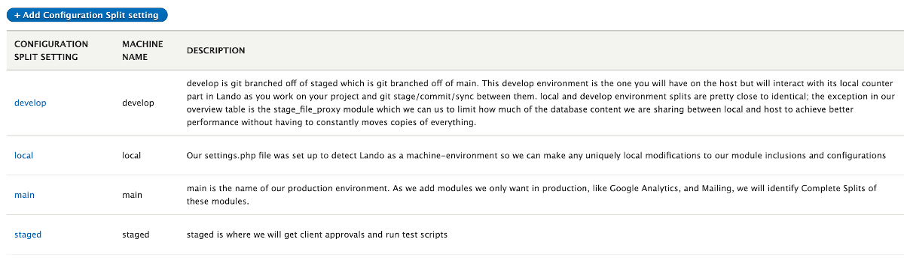

John Picozzi [“Configuration Management & Config Split”](https://www.youtube.com/watch?v=rwKjVVhOHs4) is a nice but long video on some additional options for splits like even Multi-site environments. He doesn’t use the same approach to environment case detection and the ‘case’ test; but something fairly similar. He also doesn’t do the environment-indicator but actually uses system.site within split configurations to do the same sort of thing manually as a demonstration of the ‘yml’ level conditional (rather than full module) splits.

Some of the customizations in the ‘local’ and ‘develop’ splits may be for more advanced developers. Drupal is built using an Object Oriented Programming language, to a large extent a [Symfony framework](https://symfony.com/)[] version of PHP. You can do stuff at an extremely low level where you are leveraging some unique strengths of how Drupal database structures are organized and OOP programming allows reuse of fundamental function calls to literally ‘create’ not only your own modules but even core entities below those represented in Content Types made up of multiple bundles. If you are a developer familiar with OOP and PHP you might want to turn on the “D” items in the above table. The “B” items are for beginning developer and would be something that those who want to glimpse under the hood to gain in understanding. The “S” items are for site builders who are mainly oriented toward using all that is core to Drupal itself and the tens of thousands of contributed modules others have already written. This later group is for the normal humans like you and me to do 99% of anything we really want.

[See what the YML files in configuration do.](https://armtec.services/cicd/configsplit4.html) By understanding their role you can look each up and determine how you might want to split their use. What you do when you want to split one is to copy the file from the ‘config/sync’ subdirectory and paste the copy into the directory you want to have some different action take place. Then open that file in your VSCode editor and review the code it contains. Since it is YML, a very “English” syntax, it is pretty easy to figure out what you would want to edit to make a change. Typically just something like changing a TRUE to a FALSE. Some examples of [how a number of Configuration keys are set to changed values in a development setting can be found here.](https://github.com/drush-ops/drush/issues/5109)

### Know where you are - Environment Indicator

What they do and look like

Any time you are running multiple environments, there is always a risk of not being clear where the heck you are looking and working. There is a contributed module that we are going to install and enable that is meant to give you signals to tell you which environment you are seeing; it is called the Environment_Indicator module.  At the top of the four columns in the table above you see the environment names of 'local', 'develop', 'staged', or 'main' and just below it the code codes have have been set for their display. (You can change the colors to your preference, but don't change the names unless you are ready to change them in the project code too.)

The Environment_Indicator module shows the names and colors you have given the environmentsin bands at the top of your pages to send a strong message of where you are. In the first example you see how our ‘main’ environment shows that name in a red band.  Warning this is NOT an environment you want to do edits in directly.

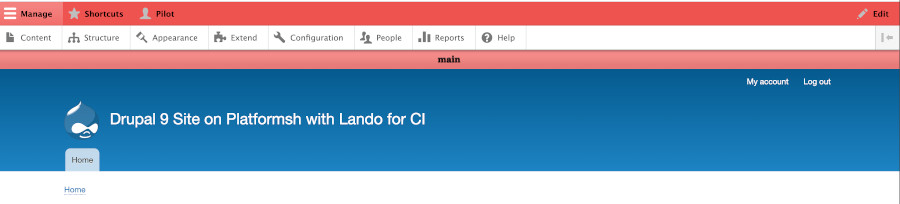

For our ‘local’ environment we see that name in a green band signaling it is safe to work in here.

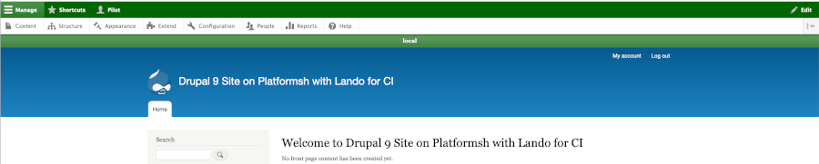

### Who sees these indicators

Don’t worry they only show when logged in as the Administrator or other authorized worker; Regular site visitors see a normal website.

Before we get into configuring the names and color indicators of different environments, lets take a look at an area we haven’t talked about so far. There is a menu item under Administration called ‘People’ and what this addresses if the ‘who can do and see what’ on a Drupal site. There are four default standard roles; you can make more if you need, but that is beyond the scope of the immediate need. An ‘Anonymous User’ is self explanatory. An ‘Authenticated User’ is someone who is logged in. A ‘Content Editor’ typically is granted permissions to do lots of other stuff on a site and putting in text, images, etc. would be common. You are the ‘Administrator’ and you have permission to do everything.

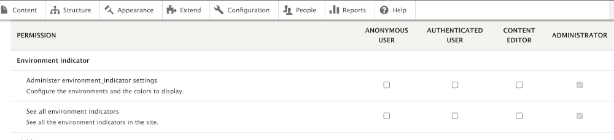

Right now, the only one who can config the Environment_Indicator is the ‘Administrator’. This is common for foundational level items around building a website. So it is not surprising that the Config_split and even the core Configuration Manager configurations are under the control of the ‘Administrator’.

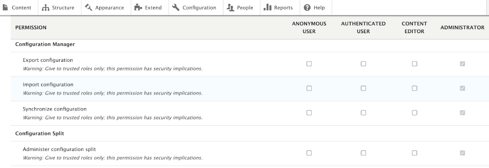

[For more on the Environment Indicator Module](https://www.drupal.org/project/environment_indicator) you can watch this [video](https://www.youtube.com/watch?v=8WbP9ZYxAx0)


### Sensing The Environment

All this different environment splits and indicators  stuff could make your head spin.  However, the way this template is put together all this is sort of automated.  Not in the sense that you can't customize the heck out of what you want to be happening in any given environment; so it you want to apply some test each time you update the 'develop' environment and then all sort of other tests with 'staged', you can do that.

What is automated is that as you work in an environment, or you move between them, the system itself senses which you are in and activates what you have set up.  It does this with its unique `settings.php` file.  You can look in the actual file for much more detail.  However, you get a feel for how it is doing this magic by looking at the code example below:

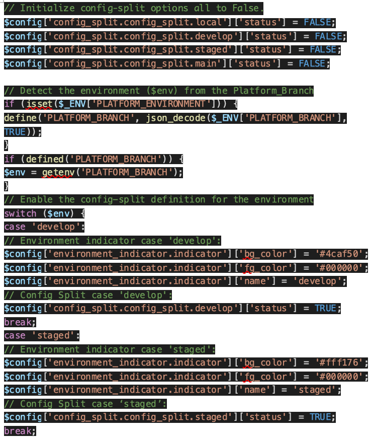
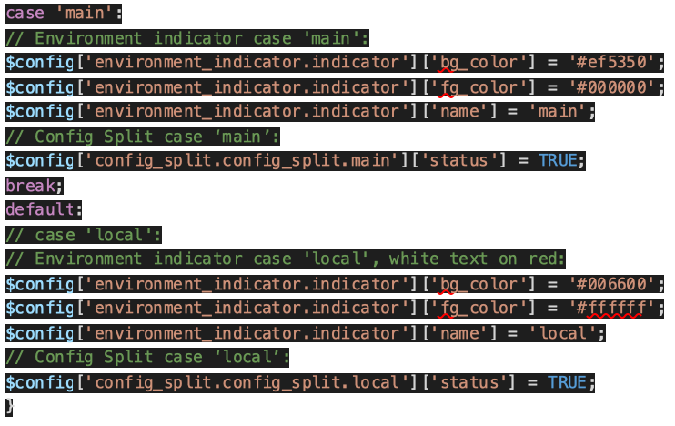

The above code grabs the branch name from Platform.sh detecting the environment you are in and checks that in the “switch case” condition. There it sets the correct environment indicator colors and name plus sets the flag to ‘active’ in the correct environment of the config_split module.

NOTE: Two key “watch outs” if you want to edit any of this. Like any code syntax, make sure you use an actual editor tool or terminal and NOT a word processor; a word processor uses a slightly different characters set and those things that look like single or double quotes wouldn’t be backticks like they need to be. Second, if you add more “case” conditions, it is critical that each sections ends in a “break” statement; with a “break”, once a condition is found it stops searching but without the “break” it will likely ‘activate’ the found case condition PLUS the default local Lando case even if you aren’t local.

Video instructions on [Configuring the Environment Indicator for Drupal](https://www.youtube.com/watch?v=8WbP9ZYxAx0)


</details>

<details>
<summary><h3>Blackfire.io: (Performance for Production environment. Click to open)</h3></summary>

### Blackfire.io: creating a Continuous Observability Strategy

This template includes a starting [`.blackfire.yml`](.blackfire.yml) file that can be used to enable [Application Performance Monitoring](https://blackfire.io/docs/monitoring-cookbooks/index), [Profiling](https://blackfire.io/docs/profiling-cookbooks/index), [Builds](https://blackfire.io/docs/builds-cookbooks/index) and [Performance Testing](https://blackfire.io/docs/testing-cookbooks/index) on your project. Platform.sh comes with Blackfire pre-installed on application containers, and [setting up requires minimal configuration](https://docs.platform.sh/integrations/observability/blackfire.html).

* [What is Blackfire?](https://blackfire.io/docs/introduction)
* [Configuring Blackfire.io on a Platform.sh project](https://docs.platform.sh/integrations/observability/blackfire.html)
* [Blackfire.io Platform.sh documentation](https://blackfire.io/docs/integrations/paas/platformsh)
* [Profiling Cookbooks](https://blackfire.io/docs/profiling-cookbooks/index)
* [Monitoring Cookbooks](https://blackfire.io/docs/monitoring-cookbooks/index)
* [Testing Cookbooks](https://blackfire.io/docs/testing-cookbooks/index)
* [Using Builds](https://blackfire.io/docs/builds-cookbooks/index)
* [Configuring Integrations](https://blackfire.io/docs/integrations/index)

</details>

## Migrate

The steps below outline the important steps for migrating your application to Platform.sh - adding the required configuration files and dependencies, for example.
Not every step will be applicable to each person's migration.
These steps actually assume the earliest starting point possible - that there is no code at all locally, and that this template repository will be rebuilt completely from scratch.

- [Getting started](#getting-started-1)
- [Adding and updating files](#adding-and-updating-files)
- [Dependencies](#dependencies)
- [Deploying to Platform.sh](#deploying-to-platformsh)
- [Migrating your data](#migrating-your-data)
- [Next steps](#next-steps)

If you already have code you'd like to migrate, feel free to focus on the steps most relevant to your application and skip the first section.

### Getting started

Assuming that your starting point is no local code, the steps below will setup a starting repository we can begin to make changes to to rebuild this template and migrate to Platform.sh.
If you already have a codebase you are trying to migrate, move onto the next step - [Adding and updating files](#adding-and-updating-files) - and substitute any reference to the default branch `main` with some other branch name.


```bash
$ mkdir drupal11 && cd drupal11
$ git init
$ git remote add upstream https://github.com/drupal/recommended-project.git
$ git branch -m main
$ git fetch --all --depth=2
$ git fetch --all --tags
$ git merge --allow-unrelated-histories -X theirs 11.x

```


### Adding and updating files

This project has been preconfigured beyond what is done using the standard Platform.sh template.  Therefore, the series of files noted in the standard template should already be found where expected.  However, the list of those files and their descriptions from the standard Platform.sh template GitHub repository is repeated here in case you want to check or if you might want to learn about potential modifications you might make.  

Open the dropdown below to view all of the **Added** and **Updated** files you'll need to reproduce in your migration.

<details>
<summary><strong>View files</strong></summary><br/>


|  File | Purpose    |
|:-----------|:--------|
| [`config/sync/.gitkeep`](config/sync/.gitkeep) | **Added** |
| [`web/sites/default/settings.php`](web/sites/default/settings.php) | **Updated:**<br><br> The Drupal settings file has been updated to import and use `web/sites/default/settings.platformsh.php`. |
| [`web/sites/default/settings.platformsh.php`](web/sites/default/settings.platformsh.php) | **Added:**<br><br> Contains Platform.sh-specific configuration, namely setting up the database connection to the MariaDB service and caching via Redis. |
| [`.environment`](.environment) | **Added:**<br><br> The `.environment` file is a convenient place to [set environment variables](https://docs.platform.sh/development/variables/set-variables.html#set-variables-via-script) relevant to your applications that may be dependent on the current environment. It is sourced before the start command is run, as the first step in the `deploy` and `post_deploy` hooks, and at the beginning of each session when you SSH into an application container. It is written in dash, so be aware of the differences to bash.<br><br>It can be used to set any environment variable, including ones that depend on Platform.sh-provided variables like `PLATFORM_RELATIONSHIPS` and `PLATFORM_ROUTES`, or to modify `PATH`. This file should not [produce output](https://docs.platform.sh/development/variables/set-variables.html#testing-environment-scripts).<br><br> Here, the Composer config and `PATH` are updated to allow executable app dependencies from Composer to be run from the path (i.e. `drush`). |
| [`.gitignore`](.gitignore) | **Added:**<br><br> A `.gitignore` file is not included in the upstream, so one has been added. |
| [`.platform.app.yaml`](.platform.app.yaml) | **Added:**<br><br> This file is required to define the build and deploy process for all application containers on Platform.sh. Within this file, the runtime version, relationships to service containers, and writable mounts are configured. It's also in this file that it is defined what dependencies are installed, when they are installed, and that package manager will be used to do so.<br><br>Take a look at the [Application](https://docs.platform.sh/configuration/app.html) documentation for more details about configuration. For more information about the sequence of events that lead from a build to deployment, see the [Build and deploy timeline documentation](https://docs.platform.sh/overview/build-deploy.html).<br><br> This template uses Composer 2 to install dependencies using the default `composer` [build flavor](https://docs.platform.sh/languages/php.html#build-flavor) prior to the `build` hook. Drush tasks are run during the `deploy` hook, and referenced again during the defined `cron` job. |
| [`drush/platformsh_generate_drush_yml.php`](drush/platformsh_generate_drush_yml.php) | **Added:**<br><br> This file has been included to generate the drush yaml configuration on every deployment. |
| [`.platform/services.yaml`](.platform/services.yaml) | **Added:**<br><br> Platform.sh provides a number of on-demand managed services that can easily be added to your projects. It's within this file that each service's version, name, resources, and additional configuration are set. See the [Services documentation](https://docs.platform.sh/configuration/services.html) for more details on configuration, version and service availability.<br><br> In this template, MariaDB and Redis have been configured. |
| [`.platform/routes.yaml`](.platform/routes.yaml) | **Added:**<br><br> This file is require to deploy on Platform.sh, as it defines how requests should be handled on the platform. It's within this file that redirects and basic caching can be configured. See the [Routes documentation](https://docs.platform.sh/configuration/routes.html) for more configuration details.<br><br> |
| [`php.ini`](php.ini) | **Added:**<br><br> An initial `php.ini` file has also beed added. The settings are a result of performance testing and best practice recommendations coming from [Blackfire.io](https://blackfire.io). They will initialize Drupal with a number of good baseline performance settings for production applications, and complement many of the tests specified in [`.blackfire.yml`](.blackfire.yml). |
| [`.blackfire.yml`](.blackfire.yml) | **Added:**<br><br> This file has been added to help you get started using [Blackfire.io](https://blackfire.io) on your project. See [the Blackfire section below](#blackfireio-creating-a-continuous-observability-strategy) for more information on how to get started. |
| [`.lando.upstream.yml`](.lando.upstream.yml) | **Added:**<br><br> This file configures [Lando](https://docs.platform.sh/development/local/lando.html) as a local development option for this template. See the [Platform.sh Lando plugin documentation](https://docs.lando.dev/platformsh/) for more information about configuration and the [Local development](#local-development) section of this README for how to get started. |
| [`.ddev/providers/platform.yaml`](.ddev/providers/platform.yaml) | **Added:**<br><br> This file configures [ddev](https://ddev.readthedocs.io/en/latest/users/providers/platform/) as a local development option for this template. See the [Platform.sh ddev integration documentation](https://ddev.readthedocs.io/en/latest/users/providers/platform/) for more information about configuration and the [Local development](#local-development) section of this README for how to get started. Be sure to follow the instructions provided through the ddev CLI and in the comments section of that file to correctly configure ddev for your project. |


</details>

### Dependencies and configuration

Sometimes it is necessary to install additional dependencies to and modify the configuration of an upstream project to deploy on Platform.sh.
When it is, we do our best to keep these modifications to the minimum necessary.
Run the commands below to reproduce the dependencies in this template.


```bash
$ composer require platformsh/config-reader drush/drush drupal/redis
$ composer config allow-plugins.composer/installers true --no-plugins
$ composer config allow-plugins.drupal/core-composer-scaffold true --no-plugins
$ composer config allow-plugins.drupal/core-project-message true --no-plugins
$ composer config allow-plugins.cweagans/composer-patches true --no-plugins

```


### Deploying to Platform.sh

Your repository now has all of the code it needs in order to deploy to Platform.sh.


<details>
<summary>Deploy directly to Platform.sh from the command line</summary>
<!-- <blockquote>
<br/> -->

1. Create a free trial:

   [Register for a 30 day free trial with Platform.sh](https://auth.api.platform.sh/register). When you have completed signup, select the **Create from scratch** project option. Give you project a name, and select a region where you would like it to be deployed. As for the *Production environment* option, make sure to match it to this repository's settings, or to what you have updated the default branch to locally.

1. Install the Platform.sh CLI

   #### Linux/OSX

   ```bash
   curl -sS https://platform.sh/cli/installer | php
   ```

   #### Windows

   ```bash
   curl -f https://platform.sh/cli/installer -o cli-installer.php
   php cli-installer.php
   ```

   You can verify the installation by logging in (`platformsh login`) and listing your projects (`platform project:list`).

1. Set the project remote

   Find your `PROJECT_ID` by running the command `platform project:list`

   ```bash
   +---------------+------------------------------------+------------------+---------------------------------+
   | ID            | Title                              | Region           | Organization                    |
   +---------------+------------------------------------+------------------+---------------------------------+
   | PROJECT_ID    | Your Project Name                  | xx-5.platform.sh | your-username                   |
   +---------------+------------------------------------+------------------+---------------------------------+
   ```

   Then from within your local copy, run the command `platform project:set-remote PROJECT_ID`.

1. Push

   ```bash
   git push platform DEFAULT_BRANCH
   ```

<!-- <br/>
</blockquote> -->
</details>

<details>
<summary>Integrate with a GitHub repo and deploy pull requests</summary>
<!-- <blockquote>
<br/> -->

1. Create a free trial:

   [Register for a 30 day free trial with Platform.sh](https://auth.api.platform.sh/register). When you have completed signup, select the **Create from scratch** project option. Give you project a name, and select a region where you would like it to be deployed. As for the *Production environment* option, make sure to match it to whatever you have set at `https://YOUR_NAMESPACE/nextjs-drupal`.

1. Install the Platform.sh CLI

   #### Linux/OSX

   ```bash
   curl -sS https://platform.sh/cli/installer | php
   ```

   #### Windows

   ```bash
   curl -f https://platform.sh/cli/installer -o cli-installer.php
   php cli-installer.php
   ```

   You can verify the installation by logging in (`platformsh login`) and listing your projects (`platform project:list`).

1. Setup the integration:

   Consult the [GitHub integration documentation](https://docs.platform.sh/integrations/source/github.html#setup) to finish connecting your repository to a project on Platform.sh. You will need to create an Access token on GitHub to do so.

<!-- <br/>
</blockquote> -->
</details>

<details>
<summary>Integrate with a GitLab repo and deploy merge requests</summary>
<!-- <blockquote>
<br/> -->

1. Create a free trial:

   [Register for a 30 day free trial with Platform.sh](https://auth.api.platform.sh/register). When you have completed signup, select the **Create from scratch** project option. Give you project a name, and select a region where you would like it to be deployed. As for the *Production environment* option, make sure to match it to this repository's settings, or to what you have updated the default branch to locally.

1. Install the Platform.sh CLI

   #### Linux/OSX

   ```bash
   curl -sS https://platform.sh/cli/installer | php
   ```

   #### Windows

   ```bash
   curl -f https://platform.sh/cli/installer -o cli-installer.php
   php cli-installer.php
   ```

   You can verify the installation by logging in (`platformsh login`) and listing your projects (`platform project:list`).

1. Create the repository

   Create a new repository on GitLab, set it as a new remote for your local copy, and push to the default branch.

1. Setup the integration:

   Consult the [GitLab integration documentation](https://docs.platform.sh/integrations/source/gitlab.html#setup) to finish connecting a repository to a project on Platform.sh. You will need to create an Access token on GitLab to do so.

<!-- <br/>
</blockquote> -->
</details>

<details>
<summary>Integrate with a Bitbucket repo and deploy pull requests</summary>
<!-- <blockquote>
<br/> -->

1. Create a free trial:

   [Register for a 30 day free trial with Platform.sh](https://auth.api.platform.sh/register). When you have completed signup, select the **Create from scratch** project option. Give you project a name, and select a region where you would like it to be deployed. As for the *Production environment* option, make sure to match it to this repository's settings, or to what you have updated the default branch to locally.

1. Install the Platform.sh CLI

   #### Linux/OSX

   ```bash
   curl -sS https://platform.sh/cli/installer | php
   ```

   #### Windows

   ```bash
   curl -f https://platform.sh/cli/installer -o cli-installer.php
   php cli-installer.php
   ```

   You can verify the installation by logging in (`platformsh login`) and listing your projects (`platform project:list`).

1. Create the repository

   Create a new repository on Bitbucket, set it as a new remote for your local copy, and push to the default branch.

1. Setup the integration:

   Consult the [Bitbucket integration documentation](https://docs.platform.sh/integrations/source/bitbucket.html#setup) to finish connecting a repository to a project on Platform.sh. You will need to create an Access token on Bitbucket to do so.

<!-- <br/>
</blockquote> -->
</details>


### Migrating your data


If you are moving an existing site to Platform.sh, then in addition to code you also need to migrate your data. That means your database and your files.

<details>
<summary>Importing the database</summary><br/>

First, obtain a database dump from your current site and save your dump file as `database.sql`. Then, import the database into your Platform.sh site using the CLI:

```bash
platform sql -e main < database.sql
```

</details>
<details>
<summary>Importing files</summary><br/>

You first need to download your files from your current hosting environment.
The easiest way is likely with rsync, but consult your old host's documentation.

The `platform mount:upload` command provides a straightforward way to upload an entire directory to your site at once to a `mount` defined in a `.platform.app.yaml` file.
Under the hood, it uses an SSH tunnel and rsync, so it is as efficient as possible.
(There is also a `platform mount:download` command you can use to download files later.)
Run the following from your local Git repository root (modifying the `--source` path if needed and setting `BRANCH_NAME` to the branch you are using).

A few examples are listed below, but repeat for all directories that contain data you would like to migrate.

```bash
$ platform mount:upload -e main --mount web/sites/default/files --source ./web/sites/default/files
$ platform mount:upload -e main --mount private --source ./private
```

Note that `rsync` is picky about its trailing slashes, so be sure to include those.

</details>


### Next steps

With your application now deployed on Platform.sh, things get more interesting.
Run the command `platform environment:branch new-feature` for your project, or open a trivial pull request off of your current branch.

The resulting environment is an *exact* copy of production.
It contains identical infrastructure to what's been defined in your configuration files, and even includes data copied from your production environment in its services.
On this isolated environment, you're free to make any changes to your application you need to, and really test how they will behave on production.

After that, here are a collection of additional resources you might find interesting as you continue with your migration to Platform.sh:

- [Local development](#local-development)
- [Troubleshooting](#troubleshooting)
- [Adding a domain and going live](https://docs.platform.sh/domains/steps.html)
- [(CDN) Content Delivery Networks](https://docs.platform.sh/domains/cdn.html)
- [Performance and observability with Blackfire.io](https://docs.platform.sh/integrations/observability/blackfire.html)
- [Pricing](https://docs.platform.sh/overview/pricing.html)
- [Security and compliance](https://docs.platform.sh/security.html)


## Learn

### Troubleshooting


<details>
<summary><strong>Accessing logs (Click to open)</strong></summary><br/>

After the environment has finished its deployment, you can investigate issues that occured on startup, `deploy` and `post_deploy` hooks, and generally at runtime using the CLI. Run the command:

```bash
platform ssh
```

If you are running the command outside of a local copy of the project, you will need to include the `-p` (project) and/or `-e` (environment) flags as well.
Once you have connected to the container, [logs](https://docs.platform.sh/development/logs.html#container-logs) are available within `/var/log/` for you to investigate.

</details>


<details>
<summary><strong>Rebuilding cache (Click to open)</strong></summary><br/>

You may run into a database error after installing Drupal on your production environment initially.
To fix, SSH into the application container (`platform ssh`) and rebuild the cache using Drush:

```bash
drush cache-rebuild

or

drush cr
```

</details>


<details>
<summary><strong>Default <code>hash_salt</code> behavior (Click to open)</strong></summary><br/>

Drupal's [default settings set](https://github.com/drupal/drupal/blob/10.3.x/core/assets/scaffold/files/default.settings.php#L252) `hash_salt` to an empty string:

```php
$settings['hash_salt'] = '';
```

In the past, Platform.sh templates have overridden this value:

```php
$settings['hash_salt'] = $settings['hash_salt'] ?? $platformsh->projectEntropy;
```

This setting was insufficient to cover some user configurations - such as those cases when an application depends on a `Null` value for `hash_salt`.

Now, the setting looks like this in `settings.platformsh.php`:

```bash
$settings['hash_salt'] = empty($settings['hash_salt']) ? $platformsh->projectEntropy : $settings['hash_salt'];
```

This change sets `hash_salt` to the built-in environment variable `PLATFORM_PROJECT_ENTROPY` value if the project contains the default settings OR `Null`.
If your application code *depends* on an empty value, feel free to comment out that line, or reset again later in that file.

Feel free to visit [`platformsh-templates/drupal9#73`](https://github.com/platformsh-templates/drupal9/pull/73) for more details on this discussion.

</details>


<details>
<summary><strong>Resources and Reference Material (Click to Open)</strong></summary>


- [Drupal](https://www.drupal.org/)
- [Drupal on Platform.sh](https://docs.platform.sh/guides/drupal/deploy.html)
- [Platform.sh PHP documentation](https://docs.platform.sh/languages/php.html)
- [Drupal at your Fingertips](https://www.drupalatyourfingertips.com)
- [WebWash Drupal Videos](https://www.webwash.net/?s=drupal)
- [The DropTimes](https://www.thedroptimes.com)
- [Drupalize.me Guides](https://drupalize.me/search?f%5B0%5D=type%3Acourse&f%5B1%5D=type%3Aguide)
- [DDEV](https://ddev.readthedocs.io/en/stable/)
- [Drupal-Helps Tips](https://drupalhelps.com/tips)
- [Git & GitHub Basics](https://www.youtube.com/watch?v=Fk12ELJ9Bww)
- [VSCode](https://code.visualstudio.com/docs)
- [Working with GitHub in VS Code](https://code.visualstudio.com/docs/sourcecontrol/github)
- [YML,HTML,CSS,JS,SQL,Bootstrap,PHP Tutorials](https://www.tutorialspoint.com/yaml/index.htm)
- [Computer Setup for a new MacBook](https://www.youtube.com/watch?v=GK7zLYAXdDs)
- [OhMyZSH Enhanced Prompt](https://ohmyz.sh)
- [Information Basics](https://armtec.services/book/infotechoverview)
- [Pure Novice](https://armtec.services/book/Novice.html)

</details>

<details>
<summary><strong>Open Source Tools for Design and Development (Click to Open)</strong></summary>


# Open Source Solutions

Discover a plethora of amazing free tools, ranging from locally installed software to browser-based ones. Those below have been handpicked as some favorites. Remember, if you love and use an Open Source tool, give back to the community in any way you can, not just technically.

## Office Suite:

You may already have something from Microsoft or Apple that you got when you bought your computer.  These are great.  There is an open source alternative Office Suite for documents, drawings, spreadsheets, database, and even for formulas that you might want to use.

- [LibreOffice (Software)](https://www.libreoffice.org/)
- [Remember LibreOffice Extensions](https://extensions.libreoffice.org/)
  
<br>

## Design Your Site:

It is standard practice to design your first.  Start with some simple principles; 1) List out what [content you want to present,](https://www.youtube.com/watch?v=CaNt4DEeIgU) 2) Group that content into story chunks, 3) Shuffle common chunks to see which might make a separate page on a menu, 4) Within each page chunk pile think as your goal to present individual story concepts per row or horizontal block.  This video provideds [beginner layout guidance](https://www.youtube.com/watch?v=3C_22eBWpjg)  Go through the design process in easy steps with increasing levels of sophistication.  A [napkin at the bar isn't off the table as a first level option](https://www.youtube.com/watch?v=35e16QDFE7k) even for a website that eventually may be developed in something as sophisticated as Drupal.   Pencil and pad are pretty easy to rough something out and change.  You might move to a drawing tool in your Office Suite to make something to show others and get a first reaction.  The pictures you use in your mockup might come from free internet images, your own camera, or illustrations you do.  For website design at increasing detail, move to using some easy tools before you start actually programming it.  Some [even suggest code](https://penpot.app/) that will get you a step ahead in front-end development of your site.

### Text
- [Doc/DocX to Markup Converter (Online)](https://word2md.com/){:target="_blank"}
- [Markup Editor (Online & Download)](https://readme.so/editor){:target="_blank"}
- [Find a Quote (Online)](https://metaphor.systems/){:target="_blank"}
- [Lorem Ipsum Generator (Online)](https://lipsum.com/){:target="_blank"}
- [AI Content Editor (Online)](https://app.writesonic.com/template/da9ef70b-a08f-4640-9a27-344d1b9f7fe7/chatsonic/8e698ef5-8208-4740-96ce-db0d57a58c52){:target="_blank"}
- [Available Fonts](https://fonts.google.com/){:target="_blank"}
  
<br>

### Graphical
- [Remove a Photo Background (Online)](https://www.remove.bg/upload){:target="_blank"}
- [Object Eraser (Online)](https://magicstudio.com/magiceraser){:target="_blank"}
- [Edit a Photo (Software)](https://www.gimp.org/){:target="_blank"}
- [AI Image Generator (Software)](https://diffusionbee.com/){:target="_blank"}
- [Compress an Image (Online)](https://compressor.io/){:target="_blank"}
- [Edit a Video (Software)](https://www.vlognow.me){:target="_blank"}
- [Potential free image sources](https://Pexels.com){:target="_blank"}
- [Free Video and Images](https://coverr.co/){:target="_blank"}
- [Free Plus optional Paid images](https://unsplash.com/){:target="_blank"}

<br>	

### Layout
- [AI Color Palatte Generator (Online)](https://huemint.com/){:target="_blank"}
- [Make a Formal Mockup (Online)](https://penpot.app/){:target="_blank"}
- [UI/UX Design Tutorial](https://www.youtube.com/watch?v=c9Wg6Cb_YlU){:target="_blank"}

<br>

## Front-end:
- [Color Palette Combinations](https://fffuel.co){:target="_blank"}
- [Animation with CSS (Online)](https://animista.net/){:target="_blank"}
- [CSS Shadows](https://neumorphism.io/#8c00ff){:target="_blank"}
- [CSS Components](https://uiverse.io/all){:target="_blank"}
- [CSS Hovers](http://ianlunn.github.io/Hover/){:target="_blank"}
- [CSS Dynamic Scroll](https://michalsnik.github.io/aos/){:target="_blank"}
- [Whirl & Signal Load Effects](https://whirl.netlify.app/){:target="_blank"}
- [CSS Magic, Bling, Perspective](https://www.minimamente.com/project/magic/){:target="_blank"}
- [CSS Tricks](https://css-tricks.com/){:target="_blank"}
- [Full Integration Toolbox](https://10015.io/){:target="_blank"}
- [HyperLink Parts of a Graphic](http://www.javascriptkit.com/howto/imagemap.shtml){:target="_blank"}
- [Theming](../theme/frontoverview.md){:target="_blank"}
- [Electron Cross-Platform](https://www.electronjs.org/){:target="_blank"}
- [JavaScript (JS) Basics](https://khosee6.medium.com/an-intro-to-javascript-its-history-and-attributes-ca4d122e6450){:target="_blank"}

<br>

## Developer:
- [Composer (coordinate Drupal modules)](https://getcomposer.org/){:target="_blank"}
- [npm (Node Package Manager, JavaScript Library/Registry)](https://www.npmjs.com/){:target="_blank"}
- [vim (ultralight editor useful within a container)](https://www.vim.org/){:target="_blank"}
- [VSCode- IDE](https://code.visualstudio.com/){:target="_blank"}
- [Lando (containers locally)](https://lando.dev/){:target="_blank"}
- [Docker & Docker-Compose](https://docker-curriculum.com/){:target="_blank"}
- [PHP Code Checker (Online)](https://extendsclass.com/php-tester.html){:target="_blank"}
- [Check Your Site for Broken Links](https://www.brokenlinkcheck.com/){:target="_blank"}
    
<br>

## Handy Utilities:
- [Sticky Notes (part of Mac)](https://support.apple.com/guide/stickies/welcome/mac){:target="_blank"}
- [Calculators for EVERYTHING](https://www.omnicalculator.com/){:target="_blank"}
- [Clipboard on Steroids](https://apps.apple.com/us/app/flycut-clipboard-manager/id442160987?mt=12){:target="_blank"}
- [AI Code Documentation/Generation (Online)](https://www.figstack.com/){:target="_blank"}

<br>

## Other Open Source tools

There are websites where people concentrate on listing all sorts of Open Source tools.  Sometimes you find some good ones, other times you find a bust.  But if you have time to waste, go for it -

- [Open Source Alternative](https://www.opensourcealternative.to/){:target="_blank"}
- [Tiny Wow](https://tinywow.com/){:target="_blank"}

<br>

## YOU & Open Source

Open Source tools, are where people contribute their time to create resources that are freely accessible to the public. In return, you can give back to the Open Source community by donating your time, resources, or skills. You don't have to be a programming genius to get involved - if you have a talent for simplifying complex topics, you can make a valuable contribution. In fact, you are probably just what Open Source software developers need...

["Free software is suffering because coders don’t know how to write documentation", The Next Web, June 2, 2017
](https://thenextweb.com/news/free-software-is-suffering-because-coders-dont-know-how-to-write-documentation)

<br>

Open Source tools are not just about big software systems, but also about filling gaps in knowledge and helping people understand how to bring different parts together.  Drupal is an expecially 'community oriented' group of people helping each other.  Jump in!  Be a contributor in whatever way your talents might benefit others.

<br>
</details>

<br />
<p align="center">
<strong>Need help?</strong>
<br /><br />
<a href="https://community.platform.sh"><strong>Ask the Platform.sh Community</strong></a>&nbsp&nbsp&nbsp&nbsp&nbsp&nbsp
<a href="https://chat.platform.sh"><strong>Join us on Slack</strong></a>&nbsp&nbsp&nbsp&nbsp&nbsp&nbsp
<br />
</p>
<br />
